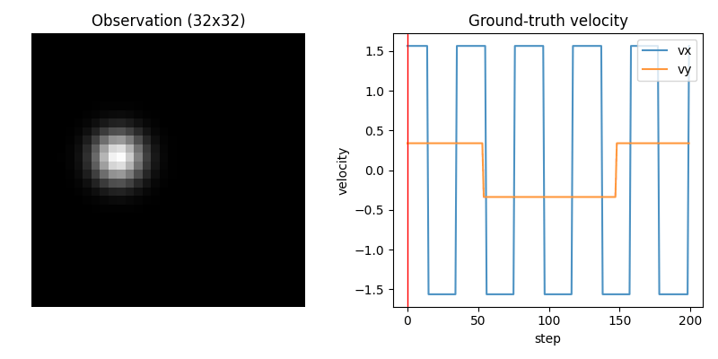
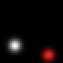
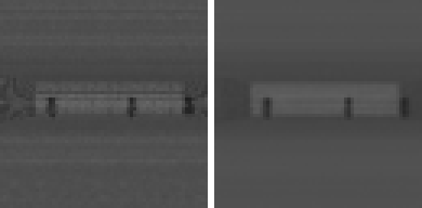
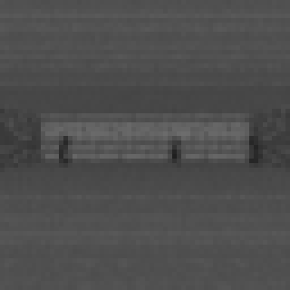

# world models

World models from scratch in JAX: the 2018 Ha and Schmidhuber recipe, a
Dreamer-style RSSM, and an actor-critic that trains entirely inside its
own dreams. Everything runs twice. First on a bouncing-ball simulator
where I know the true physics behind every frame, so I can measure what
each latent actually learned instead of guessing from reconstructions.
Then on ViZDoom `take_cover`, where the agent learns to dodge fireballs
it has only ever seen in imagination.

The code is small on purpose: every model is one file, every training
recipe is one command, and every run writes its config, metrics,
figures and gifs into its own directory. The write-ups behind the
numbers live on [victor-retamal.com](https://victor-retamal.com). This
repo is the code and the numbers.

## install

Requires [uv](https://docs.astral.sh/uv/) and Python 3.12 or newer,
which uv fetches for you.

```
uv sync
```

That gets you CPU JAX, which covers the whole ball side of the repo.
The extras:

```
uv sync --extra cuda    # GPU training (Linux only; on Windows use WSL2)
uv sync --extra doom    # ViZDoom, ships the scenario and a free WAD
uv sync --extra wandb   # mirror metrics to wandb; local jsonl stays canonical
```

JAX has no native Windows CUDA support, so on Windows the GPU path is a
WSL2 clone: install the Ubuntu distro, clone there, `uv sync --extra
cuda`, and check that `jax.default_backend()` reports `gpu`. Every run
records its backend and commit hash in `config.json`.

No command in this repo needs credentials. `train-online` and
`train-doom` mirror to wandb by default but degrade to local-only jsonl
if wandb is missing or logged out, and `--no-wandb` turns the mirror
off explicitly; the other trainers mirror only when given
`--wandb-project`.

## quick start

The fastest possible result, a few seconds on any laptop:

```
uv run ball-demo --gif ball.gif
```



That is the environment: a ball bouncing in a box, rendered to 32x32
grayscale. The simulator reports the true `(x, y, vx, vy)` behind every
frame, which is the whole reason to start here. When a model claims to
have learned the dynamics, a ridge probe from its latent to the true
velocity gives a number instead of a feeling.

The ball pipeline, in dependency order:

```
uv run make-data                          # ball dataset, 500 x 200 steps
uv run make-data --task follow            # moving-goal dataset

uv run train-vae  --run-name warmup5k --beta 1.0 --beta-warmup-steps 5000
uv run train-gru  --predict direct --latent-source mean
uv run train-rssm --run-name base
uv run train-rssm --data data/ball_follow.npz --run-name follow
uv run train-ac   --wm-run runs/rssm/follow --data data/ball_follow.npz \
                  --goal-speed 1.0 --run-name follow

uv run train-online --run-name follow     # collect, train WM, train AC
```

This is what the end of that pipeline looks like. The online world
model dreaming the follow task, and the actor it trained, chasing the
real target:




On my RTX 5070 Ti: the VAE takes about 2 minutes, the GRU 3, the RSSM
20, the actor-critic 5. CPU runs work and match to a few decimals
(float32 reduction order differs across backends). `train-gru` takes
`--predict {direct,residual}` and `--latent-source {mean,sample}`;
`train-online` supports `--resume`, which continues a killed run to
byte-identical checkpoints, and `--final-ac-steps`, which re-fits a
fresh actor against the finished world model.

The headline of the ball arc, ridge probe from model state to true
velocity (same dataset, same episode-level split, same 128-dim state
where sizes would otherwise differ):

| model | velocity R² | position R² |
|---|---|---|
| VAE latent (single frame) | 0.00 | 0.75 |
| frozen VAE + GRU | 0.81 | 0.98 |
| joint RSSM | 0.96 | 0.998 |

The first row is the first lesson of the whole repo: a single-frame
autoencoder places the ball perfectly and knows nothing about where it
is going. Reconstruction alone does not buy you dynamics. The gap
between the last two rows is what training the encoder jointly with
the dynamics buys.

Open-loop drift, pixel MSE against the real continuation after 4
warm-up transitions (reference levels: 0.011 is the mean image, 0.022
is a correct ball in an uncorrelated place):

| model | k=1 | k=5 | k=15 | k=30 |
|---|---|---|---|---|
| frozen VAE + GRU (best per column) | 0.00035 | 0.0053 | 0.0162 | 0.0177 |
| joint RSSM | 0.000031 | 0.00039 | 0.0036 | 0.0129 |

Control, mean per-step reward over 100 episodes; zero-action and
random-nudge baselines both score about 0.05. The actor never touches
a real frame during training, it acts in the RSSM's imagination and
only meets the environment at evaluation:

| setup | reward |
|---|---|
| offline actor-critic, hover | 0.652 |
| offline actor-critic, follow | 0.879 |
| online loop, co-trained actor | 0.801 |
| online loop, actor re-fit on the frozen model | 0.911 |

## doom

The same machinery pointed at ViZDoom `take_cover`, the scenario from
the 2018 paper: fireballs fly at you, you strafe or you die. The
engine lives on the CPU as a stateful C++ process, so collection is a
plain Python loop; everything after the replay buffer stays jitted.

```
uv run --extra doom train-doom --wm-only --seed-episodes 1000 \
    --episodes-per-round 0 --rounds 200 --run-name pretrain

uv run --extra doom train-doom --resume --run-name pretrain --rounds 500 \
    --imagination-temperature 1.30 --ac-updates 400 \
    --ac-reset-every 100 --critic-ema 0.98 --final-ac-steps 5000

uv run python scripts/doom_eval.py --run runs/doom/pretrain --episodes 100
uv run python scripts/doom_diag.py --run runs/doom/pretrain
```

What the pretrain buys, the real episode on the left, the model's
dream of it on the right, sampled from the prior after four warm-up
frames:



The first command pretrains the world model on random play, about an
hour on an RTX 4090. The second resumes into the online loop with the
three knobs that turned out to matter, about 3.5 more hours. The third
scores the saved actors against the real engine at a sample size that
actually means something (survival variance in take_cover is brutal,
3-episode evals will lie to you). The fourth interrogates whether the
model's death predictions live somewhere imagination can reach; the
continue head has failure modes that look exactly like success, which
cost me three retrains to learn.

Mean steps survived over 100 greedy episodes, every agent trained on
the same 95k environment frames (73k random, the rest collected by the
learning actor; one step holds its action for 4 engine tics):

| setup | survival (steps) |
|---|---|
| random policy | 70.4 |
| online loop, co-trained actor | 105.7 |
| + imagination temperature 1.30 | 151.3 |
| + AC replay x4, scheduled resets, EMA critic | 152.9 |
| + both | 186.8 |

A median episode from the composed agent, the model's-eye 64x64 view
(median, not best: survival variance here is enormous, and the median
is what you should expect to see):



And the best of the same ten episodes, 367 steps, 1468 engine tics,
five times the random mean. When the reads go right, they compound:


Each row is one flag set away from the plain loop, and the knobs are
all neutral by default: `--imagination-temperature` multiplies the
prior sigma inside dreams so they get too noisy to exploit,
`--critic-ema` bootstraps the lambda-returns from a slow copy of the
critic, and `--ac-reset-every` periodically reinitializes actor and
critic to shed what they overfit. The last two rows compose almost
additively. `train-doom` shares `train-online`'s `--resume` and
`--final-ac-steps` contract. The full command sequence per row,
expected numbers, and the env vars for statistical reproduction are in
[docs/reproduce-doom.md](docs/reproduce-doom.md).

## what is here

Paths relative to `src/world_models/`.

| component | file | notes |
|---|---|---|
| Bouncing ball env | `envs/bouncing_ball.py` | pure JAX, gymnax-style, reports true `(x, y, vx, vy)` per frame |
| Goal env (RGB, reward) | `envs/bouncing_ball_goal.py` | second ball as target, static or moving |
| ViZDoom `take_cover` | `envs/doom.py` | stateful CPU wrapper, not JAX; 64x64 grayscale out |
| Conv VAE | `models/vae.py` | 32x32 in, 16-dim diagonal Gaussian latent |
| Ridge probe | `probe.py` | closed form, no sklearn |
| GRU dynamics | `models/gru_dynamics.py` | frozen-encoder, direct or residual prediction |
| RSSM | `models/rssm.py` | GRU core, prior/posterior heads, KL balancing, reward and continue heads |
| Actor-critic | `models/actor_critic.py` | TD(lambda) returns, value gradients through the dynamics |
| Open-loop rollout | `rollout.py` | shared drift protocol for every dynamics model |
| Replay buffer | `replay.py` | uint8, episode-aware eviction, save/load |
| Checkpointing | `checkpoint.py` | whole training pytree, keep-last-K plus best-by-metric |

```
src/world_models/    envs, models, training entry points
scripts/             figure and evaluation scripts that read runs/
tests/               pytest suite
```

## tests

```
uv run pytest
```

91 tests, about 5 minutes on CPU; the 7 doom tests skip without the
extra. The suite pins the properties the experiments depend on,
including byte-identical resume and the neutrality of every
default-off knob.

## acknowledgements

Ha and Schmidhuber's World Models (2018) and the Dreamer line (Hafner
et al., 2020-2023) are the recipes this repo re-derives. The
imagination temperature is theirs; the reset schedule and slow critic
come from the sample-efficiency literature (Nikishin et al. 2022,
D'Oro et al. 2023). The mistakes are my own, and several of them are
the most instructive part of the write-ups.

## license

MIT, see [LICENSE](LICENSE).
