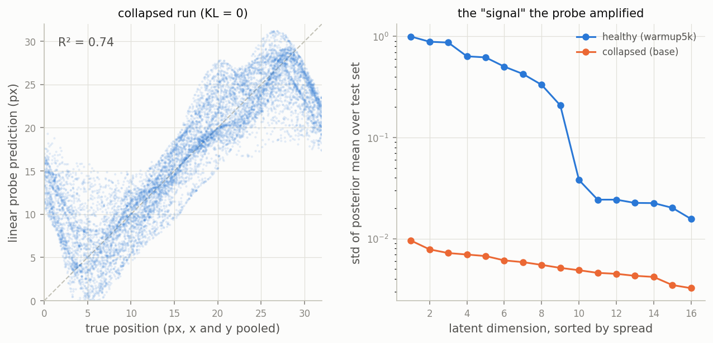

# The probe that praised a dead latent

Two models. Model A reconstructs its input almost perfectly. Model B
outputs the same near-black square no matter what you feed it — its
decoder has never drawn a ball in its life.

Linear probe from each model's latent to the ball's true position:

Model A: R² = 0.75.
Model B: R² = 0.74.

One hundredth apart. Model B is dead.

Back up. Model B was supposed to be *the* run — my VAE with the
textbook loss, beta = 1, 20k steps on the bouncing ball. It collapsed,
and it collapsed the classic way: the KL term hit zero inside the first
thousand steps and never came back. KL = 0 means the posterior equals
the prior for every input; the latent carries nothing, so the decoder
learns to output the mean image and calls it a career.

I did get a small detective moment out of the wreck. The reconstruction
loss flatlined at 11.17 and refused to move for twenty thousand steps —
and 11.17 turns out to be exactly the dataset's per-frame pixel variance
(0.104² times 1024 pixels). The loss wasn't stuck. It had *converged*,
to the best answer available to a decoder that ignores its input. On a
dataset that's 98% black pixels, "predict the mean" is a comfortable
local optimum, and full-strength KL from step zero makes the exit too
expensive to find. (The fix was ramping beta over the first 5k steps — a
knob I'd built expecting to need it later, on Doom, not on day one.
That story is in the repo's journal, entry 0004.)

Fine. Collapse diagnosed, fix confirmed. While writing the postmortem I
ran the evaluation suite on the corpse anyway — completeness, mostly —
expecting the probe to read about zero and certify the latent empty.

0.74.

If the posterior equals the prior, the latent is noise. How does a
linear map from noise recover the ball's position?

The answer is in the right panel above. The posterior means aren't
*exactly* zero — they wiggle at a scale of about 0.005, some two hundred
times smaller than the healthy model's spread. That's what "KL = 0.000"
hides past the third decimal. The wiggles are leftovers: the encoder
never stopped being a convolutional network pointed at a picture of a
ball, and its outputs never stopped correlating with the ball, even
after the KL crushed them toward the origin. Microscopic,
decoder-invisible — but systematic.

And ridge regression does not care about microscopic. R² is
scale-invariant. The probe cheerfully multiplies those wiggles by two
hundred and reads position back out; the left panel is the dead model's
actual predictions, and that's a real diagonal. The signal genuinely
exists. It's simply a hundred times too small for the model's own
decoder to use — a distinction R² is structurally incapable of noticing.

(This rhymes with an old result: linear probes on *randomly
initialized* conv nets beat chance comfortably, because the
architecture alone is a feature extractor. My collapsed encoder is that
result's trained-then-flattened cousin.)

Here's what the wreck actually taught me, and what changed in the
project because of it. A probe R² answers "is there any linearly
readable correlation in here" — not "is this representation doing its
job." It's a ratio, unitless, with no sense of magnitude. So from now
on every probe number in this project travels with two chaperones: the
KL (is the latent even alive?) and the reconstruction error (can the
model itself cash in whatever the probe found?). Any one of the three
can lie to you. It's much harder for all three to coordinate on the
same lie.

0.74 versus 0.75. The gap between a dead world model and a working one
was one hundredth of R² — and eleven units of reconstruction error,
sitting one column over, where I almost didn't look.

*(How the healthy model earned its 0.75 — and why its weak-KL sibling
with perfect reconstructions only managed 0.35 — is the other story:
[The VAE knows where the ball is. It just won't tell
you.](2026-08-09-the-vae-wont-tell-you.md))*
