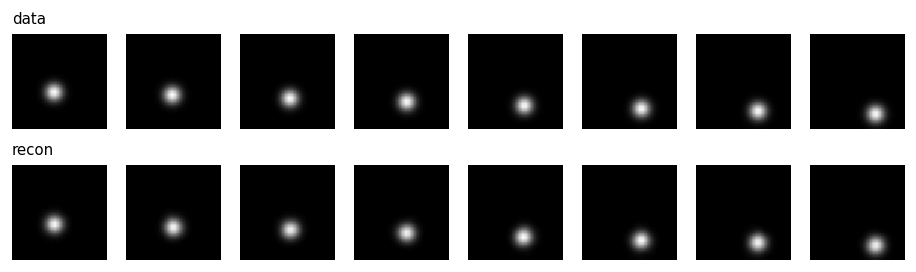
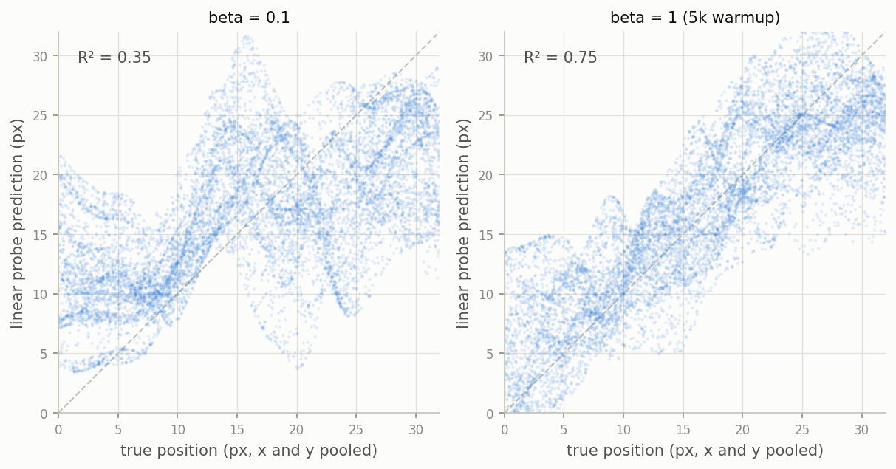
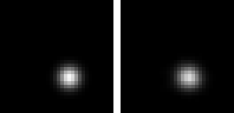

# The VAE knows where the ball is. It just won't tell you.

Look at the bottom row.

Top row is data: frames of a white ball bouncing around a 32x32 box.
Bottom row is what my VAE reconstructs from a 16-number summary of each
frame. Every ball lands in the right place. Whatever those 16 numbers
are, the ball's position is in there — it has to be, the decoder is
drawing it.

So here's a question I thought was a formality. Fit a linear regression
from those 16 numbers to the true (x, y). I know the true position
because the environment is mine and it tells me. What R² would you
expect? I expected something like 0.95, and I was prepared to be bored
by it.

R² = 0.35.

Some context for how I got here. I'm building world models from scratch
— the Ha & Schmidhuber 2018 recipe, then Dreamer's RSSM, eventually the
actual Doom experiment from the 2018 paper — and step one is the humble
VAE both of them use as an encoder. The whole reason I'm training on a
toy ball instead of a real game is this exact kind of question: I know
the ground truth, so I can interrogate the latent with a probe instead
of squinting at reconstruction grids. (Code and receipts: journal entry
0004 in this repo.)

And the first real interrogation produced a contradiction. Position is
provably present — reconstruction error 0.06, basically pixel-perfect —
and linearly absent at the same time.

The resolution, once I stopped staring, is that those are different
claims. The decoder is a stack of transposed convolutions: a flexible
nonlinear function, perfectly happy to read position off some curled-up
manifold in 16 dimensions. A linear probe is not. "The information is
there" and "the information is laid out in straight lines" are separated
by exactly the thing deep networks are good at.

You can actually see the curling. Here's predicted-vs-true position for
two VAEs with identical architecture, identical data, identical seeds
for everything except the loss schedule:

The left model is the one from the top of this post, trained with a
weak KL term (beta = 0.1). Look at the filaments. The predictions snake
around the diagonal in smooth strands — that's a nonlinear code
embarrassing a linear readout, drawn at 5,000 points. The right model is
the same VAE with the KL ramped to full strength over the first 5k
steps. R² doubles to 0.75. Reconstruction gets slightly worse (0.06 to
0.28, still a clean ball), and in exchange the code straightens out.

That trade has a name — it's the beta-VAE story. The KL term pushes the
posterior toward a factorized standard normal, and the pressure doesn't
just compress, it organizes. I knew that as a citation. It's a
different thing to watch it show up uninvited in a 20k-step toy run and
double a number you care about. A side effect I didn't plan for: the
strong-KL model also concentrates itself — of its 16 dimensions, about
9 carry real spread and the rest sit near dead, which is roughly the
right budget for a world with four degrees of freedom.

Why care about the layout at all, if the decoder copes either way?
Because of what comes next. Step two of this project bolts a recurrent
dynamics model onto these 16 numbers, *frozen* — the World Models
recipe. That GRU is nonlinear too, so in principle it can untangle the
encoder's private coordinate system before learning any dynamics. In
practice, "first untangle, then predict" is a tax, and I'd rather
measure it than assume it away. Frozen-versus-joint training is the
entire punchline of the Dreamer comparison coming up, and now there's a
baseline number for how much gets lost in translation.

Watch it track, though. Left is real, right is the reconstruction:

It knew where the ball was the whole time. It just needed a reason to
say it in a language simple models can read.

*(Companion piece, and honestly the stranger of the two stories: a
collapsed VAE — decoder fully dead — scored 0.74 on this same probe.
That one's [here](2026-08-09-the-probe-that-praised-a-dead-latent.md).)*
